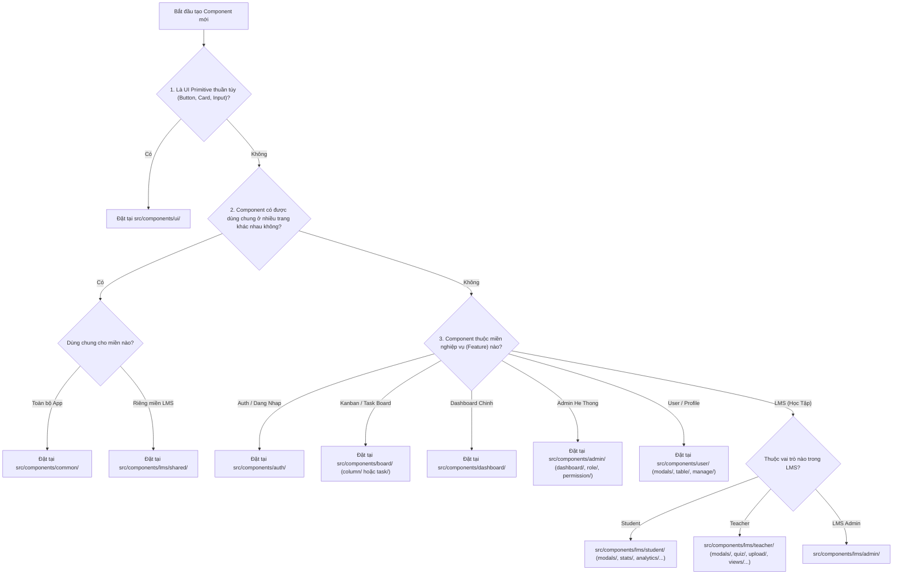
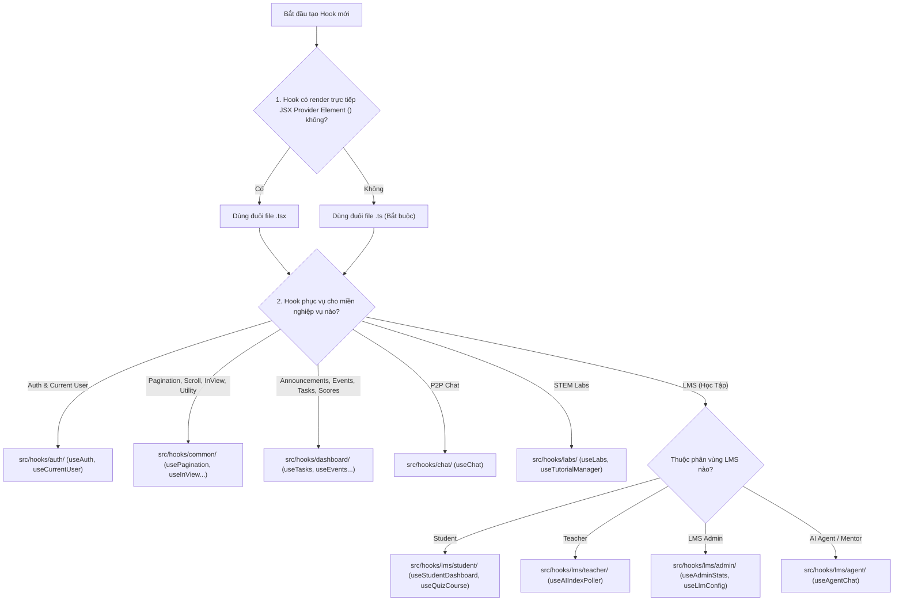

# Quy Chuẩn Kiến Trúc & Cây Quyết Định Chọn Vị Trí Cho Components & Hooks

Tài liệu này quy định kiến trúc tổ chức, vị trí đặt file, quy tắc đặt tên và cây quyết định (Decision Matrix) dành cho lập trình viên và AI Coding Agents khi tạo mới, phân tách hoặc chỉnh sửa các **Components** và **Hooks** trong dự án `BDCHub Frontend`.

---

## 1. Sơ Đồ Cấu Trúc Tổng Quan (Directory Map)

### A. Hệ thống Components (`src/components/`)

```
src/components/
├── ui/                        # Pure shadcn UI primitives (button, input, dialog, card...)
├── common/                    # App-wide reusable UI components (LoadingState, SectionHeader...)
├── auth/                      # Authentication & Authorization UI (Login, Register, Mascot...)
├── admin/                     # Platform & System Admin (role/, permission/, dashboard/)
├── board/                     # Kanban / Task Board (column/, task/)
├── chat/                      # Peer-to-Peer Chat system
├── dashboard/                 # Main Dashboard widgets (calendar/, announcement/, event/, modals/)
├── events/                    # Public Event landing & details view
├── form/                      # Surveys & Dynamic form builders
├── guide/                     # Guides & Instruction views
├── home/                      # Public Landing Page UI (hero/, About, Projects...)
├── icons/                     # SVG Icons & Icon Wrappers
├── labs/                      # STEM Interactive Simulation Labs
├── layout/                    # Page Shells & Navigation (Sidebar, Navbar, MobileNav, LmsHeader...)
├── lms/                       # Learning Management System (LMS)
│   ├── admin/                 # LMS Admin (LmsMappingModal, LmsUserRoleManager, llm-config/)
│   ├── forum/                 # LMS Discussion Forum
│   ├── shared/                # Shared LMS primitives (BreadcrumbNav, QuestionImageUploader...)
│   ├── student/               # Student experience (analytics/, content-renderers/, modals/, stats/)
│   └── teacher/               # Teacher experience (ai/, forms/, modals/, quiz/, upload/, views/)
├── markdown/                  # Markdown Editor & Renderer
├── terminal/                  # Interactive XTerminal
└── user/                      # User Profile & User Management (manage/, modals/, table/)
```

### B. Hệ thống Hooks (`src/hooks/`)

```
src/hooks/
├── auth/                      # Hooks xác thực & thông tin người dùng (useAuth, useCurrentUser)
├── common/                    # Hooks dùng chung & UI utilities (usePagination, useInView, useScrollSnap...)
├── dashboard/                 # Hooks cho Main Dashboard (useAnnouncements, useEvents, useTasks...)
├── lms/                       # Hooks cho Hệ thống Học tập LMS
│   ├── admin/                 # LMS Admin hooks (useAdminStats, useLlmConfig)
│   ├── student/               # Student hooks (useStudentDashboard, useQuizCourse, useForumPost)
│   ├── teacher/               # Teacher hooks (useAIIndexPoller)
│   └── agent/                 # LMS AI Agent / Mentor hooks (useAgentChat)
├── chat/                      # P2P Chat system hooks (useChat)
├── labs/                      # STEM Labs hooks (useLabs, useTutorialManager)
└── index.ts                   # Central Barrel Export xuất bản toàn bộ hooks
```

---

## 2. Cây Quyết Định Chọn Vị Trí (Decision Matrix)

### A. Cây quyết định vị trí cho Component mới

Khi chuẩn bị tạo một Component mới, hãy đặt các câu hỏi theo thứ tự sau:



#### Quy tắc phân loại cụ thể cho Component:
1. **Modal Component**: Không bao giờ để loose ở root folder của feature. Đưa vào subfolder `modals/` tương ứng (ví dụ: `src/components/lms/teacher/modals/ContentModal.tsx` hoặc `src/components/user/modals/DetailModal.tsx`).
2. **Table / Item Row Component**: Đưa vào subfolder `table/` hoặc `views/` (ví dụ: `src/components/user/table/UserRow.tsx`).
3. **Common Widgets**: Đưa vào `src/components/common/` và thêm re-export tại `src/components/common/index.ts`.

---

### B. Cây Quyết Định Chọn Vị Trí Cho Hook Mới

Khi chuẩn bị tạo một Custom Hook mới (`useX`), hãy đặt các câu hỏi sau:



#### Quy tắc bắt buộc đối với Hook:
1. **Quy tắc đuôi file (`.ts` vs `.tsx`)**:
   - Nếu Hook chỉ xử lý logic, state, side-effects thuần túy → **Bắt buộc dùng `.ts`**.
   - Chỉ dùng `.tsx` khi Hook có trả về hoặc khởi tạo JSX Provider element (như `usePageContext.tsx`, `useChat.tsx`).
2. **Re-export bắt buộc**: Mọi Hook mới tạo bắt buộc phải được re-export tại `src/hooks/index.ts`.

---

## 3. Quy Tac Đặt Tên & Re-Exports (Naming & Export Rules)

| Loại Đối Tượng | Quy Chuẩn Đặt Tên File | Ví Dụ Đặt Tên File | Quy Chuẩn Export |
|---|---|---|---|
| **Component File** | `PascalCase.tsx` | `TaskCard.tsx` | Named export (`export function TaskCard`) hoặc Default export |
| **Hook File (Pure Logic)** | `camelCase.ts` | `useAuth.ts` | Named export (`export function useAuth`) |
| **Hook File (With JSX Provider)** | `camelCase.tsx` | `useChat.tsx` | Named export |
| **Thư mục (Folders)** | `kebab-case` / `lowercase` | `auth`, `board`, `common`, `modals` | Không bao giờ dùng PascalCase cho tên thư mục |
| **Barrel Export File** | `index.ts` hoặc `index.tsx` | `src/hooks/index.ts` | `export * from "./auth/useAuth"` |

---

## 4. Các Anti-Patterns Cần Tránh Khi Thêm File Mới

| ❌ Đừng Làm | ✅ Hãy Thay Bằng |
|---|---|
| Tạo file `.stories.tsx` nằm trực tiếp trong `src/components/home/` | Đặt câu chuyện Storybook trong `src/stories/home/` |
| Đặt tên thư mục dùng PascalCase như `src/components/Board/` | Luôn dùng lowercase/kebab-case: `src/components/board/` |
| Để loose file modal ở root `src/components/lms/teacher/ContentModal.tsx` | Đưa vào subfolder `modals/`: `src/components/lms/teacher/modals/ContentModal.tsx` |
| Tạo hook thuần logic với đuôi `.tsx` (`useAuth.tsx`) | Dùng đuôi `.ts` chuẩn mực (`useAuth.ts`) |
| Đặt các common component (`LoadingState`, `CountDown`) trong `dashboard/` | Đưa về `src/components/common/` và re-export ở `src/components/common/index.ts` |
| Quên re-export hook mới tại `src/hooks/index.ts` | Luôn cập nhật `src/hooks/index.ts` sau khi tạo hook mới |
